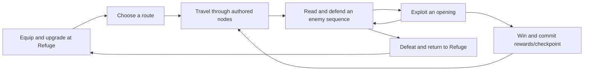

# Forever We Reign

**An original premium, offline action RPG built around portrait sword-and-shield combat, readable enemy patterns, and earned attack openings.** Developed by Praxen LLC in Unity.

Forever We Reign follows a soldier fighting through the bosses to regain his throne, only to discover that the throne is cursed. That final reveal sets up the next game. The project currently delivers application, input, timing, and graybox defense/offense foundations through Task 08, including seeded regular-enemy pattern selection. Tasks 01 through 08 have recorded scope and acceptance evidence. Task 08 supplies four bounded prototype decks, not finished production opponents. The full combat prototype, campaign, and release build remain planned work.


*GPT-Image visual prototype of the intended game. This is concept art, not a gameplay screenshot or evidence of implemented combat. Its characters, environment, and effects represent design direction. The depicted controls and their visual treatment were rejected and will be revised in Task 09. See the [generation prompt and provenance](docs/media/infinity-revival-prototype.md).*

## The intended game

Fight through a damaged weather-control complex in an original industrial fantasy world. A storm-battered foundry and coastal machinery district lead into an elevated observatory and weather-engine complex. Ceramic armor, worked brass, dark stone, weathered fabric, and restrained luminous glass define the visual direction.

The player is a soldier reclaiming his throne by fighting through the campaign bosses. The curse is discovered at the ending; its origin and effects remain open writing decisions. The [narrative brief](docs/production/narrative-brief.md) preserves the approved premise and sequel hook. The Refuge is the place to equip, upgrade, choose a route, and return after defeat. Rebirth preserves accumulated knowledge and reconstructs expedition equipment while introducing bounded difficulty progression.

Combat centers on one player and one active opponent at fixed encounter anchors. Read the tell, choose a defense, then exploit recovery or a balance break. Dodges, lunges, recoil, and finishers use authored local movement. Logical combat rules determine outcomes; weapon contact, animation, camera, audio, and effects present those outcomes.

The phone layout is designed for holding and playing with the same hand. Four-direction swipes, reachable defensive controls, mirrored layouts, and reach calibration support that goal. One-thumb usability requires physical-device acceptance and has not yet been demonstrated.

### Planned campaign scope

| Area | Design target |
| --- | --- |
| Business model | Premium purchase with the complete campaign available offline |
| Campaign | Two regions, branching authored routes, four bosses |
| Regular opponents | Four archetypes with elite variations |
| Player combat | One sword-and-shield style, three selectable active abilities |
| Equipment | 34 definitions: 12 swords, eight shields, four helmets, four armor sets, six talismans |
| Progression | Equipment upgrades and mastery, character XP, legacy perks, six bounded difficulty tiers including the base tier |
| Phones | Portrait presentation, one-thumb controls |
| iPad | Planned landscape layout using the same combat rules |
| Windows / Steam | Planned landscape presentation, mouse/keyboard and controller adapters |
| Performance | Sustained 60 FPS target; optional 120 FPS only on qualified devices |

These are production targets, not shipped features or claims of platform support. Character XP is designed to continue after equipped items are mastered. The launch design has no compulsory account, energy system, daily attendance requirement, or battle pass.

### Planned expedition loop



The [development plan](docs/production/development-plan.md) contains the full design, bounded work orders, content envelope, and acceptance gates. It is a planning baseline, not a completion record.

## What exists today

Status is grounded in the acceptance reports dated **September 29, 2026**.

| Task | Delivered scope | Evidence |
| --- | --- | --- |
| 01 | Toolchain and project inventory, canonical-root correction, readiness gaps | [Task 01 report](docs/acceptance/task-01-readiness-2026-09-29.md) |
| 02 | Repository structure, metadata and LFS rules, exact dependency baseline, source-only restoration checks | [Task 02 report](docs/acceptance/task-02-readiness-2026-09-29.md) |
| 03 | Eight assembly boundaries, application state machine, typed diagnostics, Bootstrap composition, empty Refuge, lifecycle and failure recovery | [Task 03 report](docs/acceptance/task-03-readiness-2026-09-29.md) |
| 04 | Timestamped touch capture, cardinal recognition, fixed pointer ownership and phase, cancellation, duplicate suppression, direction trace | [Task 04 report](docs/acceptance/task-04-readiness-2026-09-29.md) |
| 05 | Integer combat clock, source timestamp mapping, ordered command/milestone queue, tie rules, stall suspension and resume warning contract | [Task 05 report](docs/acceptance/task-05-readiness-2026-09-29.md) |
| 06 | Authored guard/parry/dodge masks, resources, damage, stagger, recovery, death, mixed touch queue, and a separate graybox encounter | [Task 06 report](docs/acceptance/task-06-readiness-2026-09-29.md) |
| 07 | Half-open player openings, phase-owned directional attacks, one-command buffering, combo damage, balance breaks, Focus, victory, and source-ordered raw recognition | [Task 07 report](docs/acceptance/task-07-readiness-2026-09-29.md) |
| 08 | Four immutable prototype decks, seeded weighted selection, cooldowns and history, approved observations, and atomic multi-strike admission at safe phase boundaries | [Task 08 report](docs/acceptance/task-08-enemy-patterns.md) |

Opening Bootstrap in Play Mode reaches an empty Refuge screen containing a background and title. The application handles pause/focus overlap, failure/retry, and teardown. Input capture is composed, but the interaction phase starts **Inactive**, so the screen does not run a duel or accept combat commands by default.


*Current Refuge foundation, captured by an explicit graphics-backed Editor test render at 720 x 1280. This is current implementation evidence, not physical-device acceptance.*

Open GrayboxEncounter for seeded authored patterns and player openings. Use the temporary guard/dodge controls or cardinal swipe parries during EnemySequence, then swipe in PlayerOpening to attack. The view displays the selected prototype pattern and director state alongside player resources, enemy health, balance, Focus, and remaining opening time, with suspension/resume, victory, defeat, and restart. Logical impacts apply the authored rules independently of the primitive view. A committed pattern may contain one to three strikes; one player opening follows its final recovery.


*Task 08 Unity graybox render, showing the selected enemy pattern and director state with enemy health, balance, and Focus. These controls are an instrumented test layout; Task 09 delivers the final design. This is Editor evidence, not phone acceptance. The historical Task 07 render remains preserved in docs/media.*

Latest verification: **632/632 Edit Mode tests, 60/60 Play Mode tests, and 12/12 Python validator tests, zero failures or skips**. Task 08 preserves all 488 Edit Mode and 56 Play Mode Task 07 test identities and adds 144 Edit Mode and four Play Mode tests. Actual seeded pattern/strike/resource traces are identical at 30/60/120 FPS and with jittered delivery. The [Task 08 report](docs/acceptance/task-08-enemy-patterns.md) and [machine-readable receipt](docs/acceptance/task-08-evidence-2026-09-29.json) record native results, replay traces, and preservation evidence. The historical [Task 07 report](docs/acceptance/task-07-readiness-2026-09-29.md) and [machine-readable receipt](docs/acceptance/task-07-evidence-2026-09-29.json) preserve the 488/488 Edit Mode, 56/56 Play Mode, and 12/12 Python defense/offense baseline and its replay evidence. Task 08 verification adds deterministic selection, atomic multi-strike sequences, cooldown/history rules, safe boundaries, and unfinished-input isolation to the opening/resource contracts. The historical [Task 06 report](docs/acceptance/task-06-readiness-2026-09-29.md) preserves its defense baseline. These contracts do not establish full gameplay completion.

Player builds, physical touch latency, one-thumb ergonomics, device safe areas/rotation, sustained mobile performance, and campaign combat outcomes remain **UNRUN or UNVERIFIED**. The prototype milestone is not accepted yet. Release exclusion of development automation also requires built-player evidence.

## Open the project

### Prerequisites

- Unity **6000.6.0f1**, revision **f7f8ed4d1e24**. Install and select this exact Editor; do not upgrade the project on import.
- Git and Git LFS for binary content.
- Python 3 for the structural validator and its regression suite.
- Windows PowerShell for the provided Unity batch-test runner. Mobile and Apple build/signing paths have separate acceptance requirements.

### Clone and restore LFS files

```bash
git lfs install
git clone https://github.com/clduab11/infinity-revival.git
cd infinity-revival
git lfs pull
```

The cloned **outer directory** is the Unity project root. It contains these directories directly:

```text
infinity-revival/
├── Assets/
├── Packages/
└── ProjectSettings/
```

In Unity Hub, choose **Add project from disk**, select that outer directory, and assign Unity 6000.6.0f1. Allow the pinned packages to restore, then open the scene below and enter Play Mode:

```text
Assets/Game/Scenes/Bootstrap.unity
```

For the Task 08 defense/offense and enemy-pattern encounter, open:

```text
Assets/Game/Scenes/GrayboxEncounter.unity
```

For mouse-based Editor inspection, open **Window > Analysis > Input Debugger**, then enable **Options > Simulate Touch Input From Mouse or Pen**. Hold the guard zone, tap a dodge zone, or drag through the arena to swipe. Release between gestures. This uses the installed Input System touch simulator, not the future desktop combat adapter.

Bootstrap is the first enabled build scene, with GrayboxEncounter enabled second. The preserved template SampleScene is disabled in the build list. The locally excluded alternate project is not the canonical project root.

The existing development checkout is still named infinity-redux, and the C# namespaces remain Praxen.Game. The public repository name and working game title do not require a source or asset-GUID rename.

```text
Windows development root: C:\Users\cld-main\Desktop\github-projects\infinity-redux
WSL development root:     /mnt/c/Users/cld-main/Desktop/github-projects/infinity-redux
Editor pin:              6000.6.0f1 (f7f8ed4d1e24)
```

## Controls and input scope

### Implemented recognition contract

The recognizer uses the original Input System event timestamp, normalized screen coordinates, and four cardinal directions. It commits at the first sample whose travel is strictly greater than **6% of the shorter screen dimension**, within **350 ms** of Begin. Horizontal classification wins diagonal ties. Defaults are editable in the tuning asset:

```text
Assets/Game/Content/GestureTuning.asset
```

Pointer ownership and interaction phase are captured at Begin and stay fixed. UI-owned contacts stay UI-owned when crossing into gameplay. An eligible gameplay contact produces at most one command and requires terminal release before another gesture. Expired phases, stale timestamps, timeouts, screen changes, device removal/reset, suspension, disable, and teardown cancel incomplete recognition.

An EnemySequence phase yields a typed Parry command; a PlayerOpening phase yields Attack; Inactive yields no command. A brief noninteractive trace displays accepted direction. Bootstrap starts Inactive. GrayboxEncounter alternates EnemySequence and PlayerOpening with strictly increasing phase identities. Its raw gameplay samples are recognized in source-time combat order, so a batch crossing an opening boundary uses the phase at each sample time. Old contacts cancel at a transition instead of changing intent.

See the [touch pipeline contract](docs/architecture/touch-gestures.md) for timestamp, ownership, lifecycle, and event-merging details.

### Player controls

| Input | Intended action | Current status |
| --- | --- | --- |
| Directional swipe during an enemy sequence | Parry attempt | Implemented: authored direction and inclusive 140ms impact window |
| Directional swipe during a player opening | Attack | Implemented in graybox: phase-owned impact, shared recovery, one pending command, and alternating-direction combo |
| Hold shield control | Guard | Implemented in graybox: held source contact, authored cost, guard break |
| Tap left/right dodge control | Dodge to that side | Implemented in graybox: three charges, authored side, avoidance and recovery windows |
| Tap equipped ability control | Activate the selected ability | Planned for Task 22; effects, equip flow, and persistence are not implemented |
| Tap exploration destination | Travel to an authored node | Planned |
| Drag exploration view | Limited camera inspection | Planned |

### Exact Task 07 prototype tuning

The development plan authors the 2s normal opening, 3s balance-break opening,
120ms offensive buffer, balance rewards of 25/10/5 for parry/dodge/block,
break threshold of 100, and 3s decay delay. The remaining values are editable
Task 07 prototype choices, not claims of final game balance.

| Value | Current default | Basis |
| --- | --- | --- |
| Normal / balance-break opening | 2000000us / 3000000us | Plan-authored |
| One-command buffer | 120000us; first request wins, expires at the exact deadline | Plan-authored duration; Task 07 admission contract |
| Balance gain: parry / dodge / block | 25 / 10 / 5 | Plan-authored |
| Balance break | At 100, reset to zero; 3s opening begins after committed enemy recovery | Plan-authored threshold; Task 07 boundary contract |
| Balance decay | 3s after successful defense, then one point per complete 100000us | Plan-authored delay; prototype decay rate |
| Enemy health / base attack damage | 100 / 20 | Prototype choices |
| Player windup / recovery | 100000us / 400000us, 500000us total | Prototype choices |
| Third alternating opposite-direction hit | 10% bonus (22 damage at the default), then chain resets | Prototype choice |
| Focus gain: parry / dodge / block | 25 / 10 / 5, cap 100, no decay | Prototype choices; successful-defense accumulation is plan-authored |

An opening is **[start, end)**. An admitted attack must impact strictly before its
end. A pending swipe keeps its original opening identity and can wait through
existing defense or offense recovery; it is consumed only when the action lock
ends before its expiry. Close, suspension, terminal outcome, and disposal clear
pending swipes and combo state. Player death is terminal. Enemy zero health means
victory only while the player remains alive; restart creates a fresh duel. Focus
is displayable resource accumulation only. Active ability effects, equip flow,
and persistence remain Task 22.

### Task 08 prototype enemy patterns

Sword, shield, polearm, and hammer guard decks each contain three immutable,
single-phase prototype patterns. Their teaching purposes are direction recognition,
patient defense/recovery punishment, safe dodge-side recognition, and guard
conservation/heavy attacks. These are code-authored test content; production
archetypes remain Tasks 26–29 and ScriptableObject authoring remains Task 13.

Selection uses authored weights, integer combat-time cooldowns, the last two
committed pattern IDs, captured difficulty tier, approved completed observations,
and a local encounter seed. It cannot inspect unfinished touches, pending gestures,
buffered swipe direction, or an active dodge side. A whole selected pattern is
admitted atomically and cannot be changed in response to later input. The shared
first teaching pattern preserves Task 06's one-step Up parry, safe left dodge,
impact at 660000us, and recovery at 1160000us. See the
[enemy pattern contract](docs/architecture/enemy-pattern-selection.md).

The graybox controls are temporary. Task 09 is the next work order and owns the final portrait HUD, mirrored layouts, adjustable control scale, and reach calibration. The design requires no simultaneous two-finger action. Future desktop adapters will emit the same semantic combat commands; mouse/keyboard, controller support, and landscape combat presentation are not implemented.

## Architecture

The project uses an explicit scene composition root and a small C# core. Runtime code does not depend on Editor or test assemblies. Domain, Application, and Infrastructure disable engine references, with compiled-reference tests enforcing the boundaries.

| Assembly | Current responsibility |
| --- | --- |
| Praxen.Game.Domain | Engine-free gesture recognition, integer combat clock, ordered timeline, authored defense/offense rules, health, buffering, combo, balance, Focus, immutable enemy patterns, seeded selection, and typed milestones |
| Praxen.Game.Application | Application states, diagnostics, input ports, phase context, combat sessions, atomic sequence admission, enemy director, and exclusive defense/opening transitions |
| Praxen.Game.Content | Gesture tuning asset authoring and immutable prototype enemy deck content |
| Praxen.Game.Infrastructure | Engine-free bounded diagnostic history |
| Praxen.Game.Presentation | Bootstrap, lifecycle, Refuge, touch/UI adapters, direction trace, and mixed Input System timing driver, raw defense controls, and primitive encounter view |
| Praxen.Game.Editor | Editor-only Bootstrap/input/graybox scene authoring |
| Praxen.Game.Tests.EditMode | Pure behavior and compiled assembly-boundary checks |
| Praxen.Game.Tests.PlayMode | Saved-scene, lifecycle, real Input System, UI-raycast, and presentation integration checks |

Application states are Bootstrap, Loading, Refuge, Suspended, Failed, and Shutdown. Legal transitions are explicit; invalid transitions leave state unchanged and record a typed diagnostic. The diagnostic buffer keeps the latest 128 events in chronological order and returns independent snapshots.

See the [application foundation contract](docs/architecture/application-foundation.md) for transitions, failure recovery, scene ownership, and deterministic teardown. Some early architecture descriptions record their task's original scope; the touch contract and [combat timing contract](docs/architecture/combat-timing.md) describe the later additions. Combat timing stays inactive in the Refuge until an encounter explicitly starts it. The [defense combat contract](docs/architecture/defense-combat.md) records the Task 06 encounter and temporary controls. The [offense combat contract](docs/architecture/offense-combat.md) preserves Task 07's opening, source-ordered recognition, shared action recovery, buffering, and resource contracts. The [enemy pattern contract](docs/architecture/enemy-pattern-selection.md) adds immutable decks, transactional selection, atomic multi-strike sequences, and the director's safe boundaries. Player timers remain independent of retimed enemy attack milestones after resume.

### Repository map

```text
Assets/
├── Game/
│   ├── Runtime/{Domain,Application,Content,Infrastructure,Presentation}/
│   ├── Editor/
│   ├── Content/GestureTuning.asset
│   ├── Scenes/{Bootstrap,GrayboxEncounter}.unity
│   └── Tests/{EditMode,PlayMode}/
└── ...                         Preserved Unity template assets
Packages/                       Manifest and Unity-generated lockfile
ProjectSettings/                Canonical Unity project settings
SourceArt/                      Characters, equipment, environments, audio sources
docs/
├── acceptance/                 Dated reports and machine-readable receipts
├── architecture/               Application and input contracts
├── design/                     Design documentation space
├── media/                      Intended visual prototype and provenance
├── production/                 Development plan, dependency policy, provenance
├── research/                   Research documentation space
└── superpowers/                Implementation plans and task designs
tools/
├── build/                      Validator, regression tests, Unity runner
└── content/                    Content tooling space
```

Generated caches, local editor state, root build outputs, raw task evidence under output, and the alternate project are ignored. The build tooling directory is versioned source.

## Dependency baseline

The manifest has **48 direct dependencies** and the Unity-generated lockfile has **65 resolved packages**. The principal exact pins are:

| Package | Version |
| --- | --- |
| Universal Render Pipeline | 17.6.0 |
| Input System | 1.20.0 |
| Unity UI (uGUI) | 2.6.0 |
| Timeline | 6.6.0 |
| Cinemachine | 6.6.0 |
| Addressables | 2.11.2 |
| Test Framework | 1.8.0 |
| Newtonsoft JSON | 3.2.2 |
| Pipeline | 0.8.0-exp.1 |

Animation Rigging 6.6.0 is deferred until contact correction requires it. Pipeline is an experimental development dependency; its presence does not establish release suitability or enable a service. Launch campaign content is intended to remain local and offline.

Use the [dependency policy](docs/production/dependency-policy.md) for changes. Preserve the Editor and unrelated pins, resolve through the pinned Unity Editor, and review the manifest, generated lockfile, and validator baseline together. Record transitive changes and major-version migration risks.

## Verification

Run structural checks from the repository root:

```bash
python3 tools/build/verify_baseline.py
python3 -m unittest discover -s tools/build -p 'test_*.py' -v
```

Run Unity suites from Windows PowerShell after closing the Editor for this project:

```powershell
./tools/build/run_unity_checks.ps1 -Mode EditMode -EvidenceTask task-08
./tools/build/run_unity_checks.ps1 -Mode PlayMode -EvidenceTask task-08
```

The runner uses the following fixed Editor path, validates the version/revision, rejects an active canonical Editor, temporarily disables Pipeline auto-start, and restores its prior configuration. It requires fresh, nonempty, all-passing XML receipts. It derives the project root from the script location, so a clone can use a different directory name.

```text
C:\Program Files\Unity\Hub\Editor\6000.6.0f1\Editor\Unity.exe
```

If that Editor is installed elsewhere, review the runner's path deliberately. Its default evidence label remains task-03, so pass task-08 explicitly for the current suites. New logs and XML are written under the ignored task output directory.

The [Task 08 report](docs/acceptance/task-08-enemy-patterns.md) and [machine-readable receipt](docs/acceptance/task-08-evidence-2026-09-29.json) record the current 632 Edit Mode, 60 Play Mode, and 12 Python passing results, plus seeded replay and preservation evidence.

The historical [Task 07 machine-readable receipt](docs/acceptance/task-07-evidence-2026-09-29.json) preserves its offense counts, hashes, replay, and preservation evidence. Portable [Edit Mode](docs/acceptance/evidence/task-07-editmode.xml), [Play Mode](docs/acceptance/evidence/task-07-playmode.xml), and [review](docs/acceptance/evidence/task-07-review.md) records remain intact.

The historical [Task 06 machine-readable receipt](docs/acceptance/task-06-evidence-2026-09-29.json) preserves its original defense counts, hashes, and preservation evidence. Portable [Edit Mode](docs/acceptance/evidence/task-06-editmode.xml), [Play Mode](docs/acceptance/evidence/task-06-playmode.xml), and [review](docs/acceptance/evidence/task-06-review.md) records remain intact.

The historical [Task 05 machine-readable receipt](docs/acceptance/task-05-evidence-2026-09-29.json) records its original timing baseline. Portable copies of the final [Edit Mode XML](docs/acceptance/evidence/task-05-editmode.xml), [Play Mode XML](docs/acceptance/evidence/task-05-playmode.xml), [replay comparison](docs/acceptance/evidence/task-05-replay.json), [baseline result](docs/acceptance/evidence/task-05-baseline.json), and [review record](docs/acceptance/evidence/task-05-review.md) are included for inspection.

Earlier receipts establish source-only package restoration, lifecycle behavior, and assembly boundaries. Additional raw logs referenced by historical reports remain local ignored evidence and may be absent from a clone. A synthetic Editor render does not establish physical-device acceptance.

## Development roadmap

| Stage | Remaining work and acceptance gate |
| --- | --- |
| Prototype, Tasks 09–10 | Revised portrait controls/HUD, then recorded physical-phone input/readability/frame-time evidence |
| Vertical Slice, Tasks 11–25 | Approved shared rig and assets, presentation, content definitions, Addressables, recoverable saves/transactions, progression, exploration, accessibility, one finished boss/route, sustained device and persistence acceptance |
| Alpha, Tasks 26–34 | Four regular archetypes, remaining bosses and regions, equipment catalog, campaign/rebirth completion, progression and economy validation |
| Platform and release readiness, Tasks 35–38 | iPad/Android profiles, Steam controls, reproducible release builds, automation exclusion, clean-install/upgrade/interruption/device acceptance |
| Launch preparation, Task 39 | Signed candidates, store materials, licensing records, support documentation, release archive, and explicit publication approval |

Task 05 establishes equivalent recorded event outcomes at 30/60/120 presentation rates. Task 06 verifies authored defense outcomes, resources, recovery, and death on this timing foundation. Task 07 extends the chronology with exclusive player openings, offense, balance, and Focus. Task 08 adds bounded seeded prototype decks and safe commitment; Task 09 is the next bounded work order. Persistent difficulty progression, scaling, and active abilities remain Task 22. The first finished boss must establish actual animation and encounter-production effort before the campaign schedule is treated as credible. Mobile release leads the plan; Steam follows its own acceptance gate.

No release date or supported-device list is declared. Installed build modules and successful compilation do not qualify a platform. Consult the [full development plan](docs/production/development-plan.md) before expanding a work order.

## Working on the repository

- Version complete source under Assets, Packages, and ProjectSettings, including every Unity metadata file. Move each asset with its matching metadata and preserve its GUID.
- Keep Unity YAML, scenes, prefabs, settings, and metadata as ordinary Git text. Binary art, meshes, textures, audio, video, and authoring files use the existing Git LFS rules.
- Use one writer at a time for a shared scene, prefab, controller, settings asset, or other serialized Unity asset. Coordinate ownership before editing.
- Keep authoring sources in SourceArt, content tooling under tools/content, and decisions/evidence in docs.
- Keep changes bounded to their work order. Add verification for behavior changes and preserve UNRUN/UNVERIFIED for missing acceptance evidence.
- Dependency changes include the generated lockfile and baseline review. Preserve exact pins unless the change explicitly requires otherwise.
- Keep credentials, signing keys, local configuration secrets, generated caches, and raw task output out of source control.

On the original workstation, use native Windows Git for LFS; WSL Git has no installed LFS command. Other contributors need a working Git LFS installation for their chosen Git executable.

```powershell
git lfs version
```

```bash
"/mnt/c/Program Files/Git/cmd/git.exe" lfs version
```

## Asset provenance and licensing

World, characters, writing, equipment, environments, audio, and visual identity are intended to be original. Genre references are research inputs. Do not import copied game assets, traced environments, reproduced UI, copied choreography, or derivative character designs.

Record original, commissioned, licensed, and generated content before integration using the [asset provenance requirements](docs/production/asset-provenance.md). Records must cover creator/source, commercial use, modifications, player redistribution, attribution, original hashes, authoring sources, and imported asset GUIDs. Unclear rights remain UNVERIFIED and block release eligibility.

The [GPT-Image prototype record](docs/media/infinity-revival-prototype.md) documents the illustration's prompt and available generation provenance. The image is documentation for intended design, not an imported Unity production asset or evidence of a cleared campaign asset set.

Task 08 needs no generated art. After prototype qualification, the [asset readiness plan](docs/production/asset-readiness.md) calls for a small soldier/boss/arena concept batch, followed by the approved rigged 3D pair, animations, materials, effects, UI art, and audio. GPT-Image can help with concepts and supporting imagery; character sprites do not replace this 3D pipeline.

**No project license has been selected or added.** Package and third-party components have their own terms. Working-title clearance and production asset licensing remain separate release requirements.
