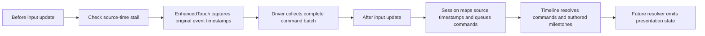

# Combat timing

Task 05 establishes one event-time chronology for combat. Domain and Application
remain engine-free; Presentation connects source input updates and lifecycle
events to that chronology. Guard, damage, attacks, recovery rules and encounter
content begin in Task 06.

The authoritative contracts are [combat specification section 3.7](../production/development-plan/03-combat-specification.md#37-combat-timing-authority)
and the [Task 05 design](../superpowers/specs/2026-09-29-task-05-timing-design.md).

## Ownership and flow

| Owner | Contract |
| --- | --- |
| `Domain/Combat/CombatClock` | Integer microsecond combat time, source-time mapping segments, stall detection, suspension and countdown |
| `Domain/Combat/CombatTimeline` | Bounded ordered records, sealed resolution boundary and uniform warning retiming |
| `Domain/Combat/CombatTimingValues` | Immutable command/milestone event payloads and typed milestone kinds |
| `Application/Combat/CombatSession` | Advance the clock, map and queue the complete command batch, then resolve chronology |
| `Presentation/Combat/CombatTimingDriver` | Input System update hooks, capture gating, lifecycle flags and encounter ownership |

The driver uses `InputState.currentTime`, the same time basis used by
EnhancedTouch. Both adapters round seconds to integer microseconds with
`MidpointRounding.AwayFromZero`. A command retains its original
`InputTimestampUs`; its timeline record also carries the mapped combat time.
The recognizer's sequence number is identity, not scheduling priority.

`InputSystem.onBeforeUpdate` checks for a stall before delayed input can be
recognized. `onAfterUpdate` supplies the entire collected batch to
`CombatSession.AdvanceFrame`, which queues it before calling
`CombatTimeline.AdvanceTo`. Dynamic, Fixed and Manual gameplay updates participate;
Editor and BeforeRender updates do not advance combat. Unity animation, physics,
camera and UI callbacks do not resolve combat records.

## Ordering and rejection

The timeline first sorts by mapped timestamp. At a common timestamp the order is:

| Priority | Record |
| --- | --- |
| 0 | Death milestone |
| 1 | Commands, FIFO by arrival |
| 2 | Telegraph milestone |
| 3 | Impact milestone |
| 4 | Phase transition milestone |
| 5 | Recovery completion milestone |
| 6 | Buffered offense milestone |

Records of the same priority retain arrival order, including reversed command
sequence numbers and milestone IDs. Defensive commands therefore reach the
future resolver before a same-time impact; their validity and gameplay effects
remain that resolver's responsibility. Attack commands are requests. The typed
buffered offense milestone does not implement Task 07 offensive buffering.

The timeline defaults to 1024 pending records. Full queues reject new records
without overwriting existing ones. Duplicate pending milestone IDs are rejected
and become reusable after resolution. The driver separately limits its collected
input batch to 1024 commands and exposes `DroppedCommandCount`; session mapping
and queue rejections increment `RejectedCommandCount`.

Advancement seals every timestamp through the completed boundary. Later delivery
at or before that boundary is rejected, never clamped or applied retroactively.
Source timestamps outside the active mapping segment, including future input,
are rejected. Replay fixtures deliver each record before advancing its containing
batch. This local contract does not support arbitrary late delivery across a
completed boundary or claim cross-platform deterministic networking.

## Suspension and resume

A source-time gap strictly greater than 150000 microseconds suspends at the last
accepted combat boundary. Exactly 150000 microseconds remains valid. Focus loss,
application pause and component disable also freeze chronology. Suspension
discards pending commands and cancels unfinished gestures; resolved events and
pending authored milestones remain retained. The composition clears the direction
trace on a suspension notification.

Resume starts a 3000000-microsecond source-time countdown with input disabled.
Focus recovery requests it automatically only when both focus and application
pause flags permit input. A frame stall requires an explicit driver
`RequestResume`. Another stall during countdown suspends again.

The first update completing countdown starts a new mapping segment at the frozen
combat time. Countdown overshoot is discarded. Input from prior segments cannot
replay. The next pending impact receives at least 650000 microseconds after the
frozen boundary; all remaining milestones shift by the same amount so their
intervals stay intact. `IncomingWarningRearmed` carries that impact time for a
presentation consumer. If warning is already sufficient, no shift occurs; if no
impact exists, there is no warning event.

## Composition and remaining work

Bootstrap composes the driver alongside Task 04 capture. Refuge starts with
`Session == null` and an Inactive phase, so combat chronology is inactive until
an encounter owner explicitly calls `BeginEncounter`. No combat buttons or
attacks are added to the scene. `EndEncounter` cancels input, advances the phase
identity to Inactive and releases the session.

The existing gesture phase port remains the Task 04 contract. Typed phase
milestones do not mutate it. A future encounter resolver must provide
timestamp-aware phase ownership when a phase boundary occurs inside one input
batch.

The user rejected the controls and their appearance in the README concept on
2026-09-29. Task 09 must revisit control layout and visual treatment. The rest of
that image remains aspirational art direction, not a gameplay capture.

Task 15 owns restart/checkpoint persistence. Final visible warning/HUD, physical
device latency, hit stop and slow motion remain unaccepted. The [Task 05 readiness
record](../acceptance/task-05-readiness-2026-09-29.md) records final automated
evidence and the remaining physical-device gates.
