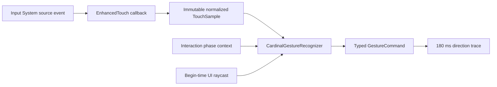

# Timestamped touch gestures

Task 04 provides the input boundary for later combat work. Domain and Application remain engine-free. The saved Bootstrap scene composes the actual Input System capture, editable tuning, ownership resolver, and brief direction trace.

## Capture to command

`TimestampedTouchCapture` copies `finger.lastTouch` within each callback. It uses the event's original time, rounded to microseconds, rather than frame time. Pointer identity combines device ID and touch ID, so different touchscreens cannot collide. Positions are normalized against the primary display's current screen dimensions. Other displays are excluded from gameplay recognition.

A shared `EnhancedTouchSession` balances Input System's reference-counted EnhancedTouch support and temporarily enables `disableRedundantEventsMerging`. The installed Input System 1.20.0 otherwise merges consecutive same-contact moves before callbacks. Losing an intermediate crossing followed by an out-and-back movement would change recognition and its timestamp. The lease tracks settings replacement and restores the prior flag on every surviving settings object when the last lease ends. The setting affects other devices too, so capture incurs additional event processing while enabled.

Changing Input System update mode rebuilds EnhancedTouch histories using current-time records. The adapter suppresses those rebuild callbacks and cancels incomplete contacts; they are not source events. Removing a touchscreen emits a terminal cancellation only for that device's contacts, timestamped at current Input State time (or the last sample's time if later). This synthetic invalidation cannot emit a command and releases the removed device's gameplay slot.

## Recognition contract

| Rule | Behavior |
| --- | --- |
| Default travel | Strictly greater than 6% of the shorter screen dimension |
| Default duration | Crossing sample at or before 350000 microseconds after Begin |
| Distance | Euclidean displacement from Begin in physical screen proportions |
| Direction | Dominant physical axis; horizontal wins diagonal ties within 1e-12 shorter-screen units |
| Commit | First delivered crossing sample, including End if no earlier crossing arrived |
| Identity | Sequence increases across resets; command keeps original timestamp, pointer, phase, direction, intent, and normalized endpoints |
| Phase | EnemySequence yields Parry; PlayerOpening yields Attack; Inactive yields no command |
| Ownership | Begin-time Gameplay, UI control, or Excluded ownership remains fixed |
| Contact policy | First active-phase gameplay contact holds the slot through commit/cancellation until terminal release; held secondary contacts never gain it |
| Cancellation | Changed phase, stale time, timeout, screen change, OS cancellation, suspension, disable, and teardown cancel incomplete gestures |

The synchronous EventSystem raycast at Begin accepts GraphicRaycaster hits and preserves the control's full 64-bit Unity EntityId. It does not depend on UI module state from a previous frame. UI-to-gameplay crossings remain UI-owned, and gameplay-to-UI crossings remain gameplay-owned. Cancellation does not recognize a final displacement. Duplicate Begin, movement after commit, and repeated terminal samples cannot produce another command.

Enabling capture seeds any already-held device contacts as excluded. This prevents disabling and re-enabling a component from manufacturing a fresh gesture. A contact begun during Inactive never arms, but it does not block a fresh active-phase contact. Raw source samples continue to be observed during application suspension, while recognition stays cancelled, so release still clears contact ownership.

## Integration

The defaults live in `Assets/Game/Content/GestureTuning.asset`. Invalid tuning fails startup rather than being silently clamped. The Editor authoring entry point `BootstrapSceneAuthoring.ConfigureInput` binds this asset without rebuilding the existing scene or changing the build list.

`BootstrapCompositionRoot.InteractionPhase` initially contains Inactive/0. The phase owner advances it with a strictly increasing identity for every phase transition, including expiration to Inactive. The recognizer compares captured identity and kind with the current phase before recognition, so an expired parry cannot become an attack.

Subscribe to `InputCapture.CommandProduced` for accepted commands and `SampleCaptured` for copied raw samples. Both callbacks run on the application thread. Bootstrap owns lifecycle gating; the command trace is noninteractive and clears on pause, focus loss, or teardown. Refuge has no active combat phase by default.

The combat clock, input queue, timing judgments, and stall policy are Task 05. Offensive buffering is Task 07; gesture surface layout is Task 09. This code does not establish physical touch latency or one-thumb ergonomics, which remain Task 10 acceptance.

## Verification

Edit Mode exercises the pure recognizer and existing assembly/application contracts. Play Mode queues real `TouchState` events through Input System, including multiple consecutive moves in one update, and checks original timestamps, actual UI raycasts, device reset, suspension, re-enable, lease restoration, startup retry, and visual feedback. No package testables or dependencies were added.

The portrait evidence uses an explicit graphics-backed URP render in the installed desktop Editor. It is separate from a player build, physical device, OS touch latency measurement, or ergonomics acceptance.
