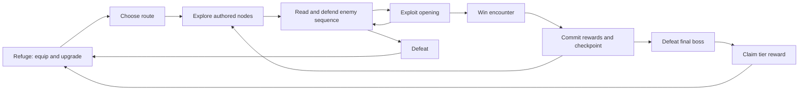

# 2. Product design and gameplay loops

## 2.1 Core loop

A normal interaction sequence is:

1. Select equipment at the refuge.
2. Choose an expedition route.
3. Move between authored exploration nodes.
4. Enter an anchored duel.
5. Read the enemy’s attack.
6. Block, dodge, or parry.
7. Exploit a recovery or balance-break opening.
8. Receive equipment, currency, mastery, and character XP.
9. Continue or stop at the newly committed checkpoint.

## 2.2 Session design

| Session | Target experience |
|---|---|
| 30–60 seconds | Inspect equipment, make an upgrade, or resume a checkpoint |
| 2–5 minutes | Complete one meaningful encounter |
| 8–12 minutes | Complete a route segment and boss attempt |
| 25–40 minutes | Complete a successful full expedition after learning the game |

These are design targets to validate through playtesting, not promised playtime.

Progress saves after every consequential transaction. Players can stop between encounters without losing expedition progress.

## 2.3 Retention and progression

Retention comes from:

- Learning opponents.
- Completing equipment collections.
- Mastering different equipment.
- Improving route efficiency.
- Unlocking abilities and legacy perks.
- Advancing through bounded rebirth tiers.
- Returning for future authored content.

Launch has no energy system, daily attendance requirement, rotating store, battle pass, or compulsory account.

### Three progression tracks

| Track | Purpose |
|---|---|
| Player skill | Better recognition, timing, direction selection, and resource management |
| Character and equipment | Gradual improvement and meaningful loadout choices |
| Rebirth progression | New pattern combinations and permanent, bounded unlocks |

**Character XP continues to accrue when equipped items are mastered.** Equipment mastery adds rewards rather than becoming the only source of advancement.

---

[Return to development plan](../development-plan.md)
