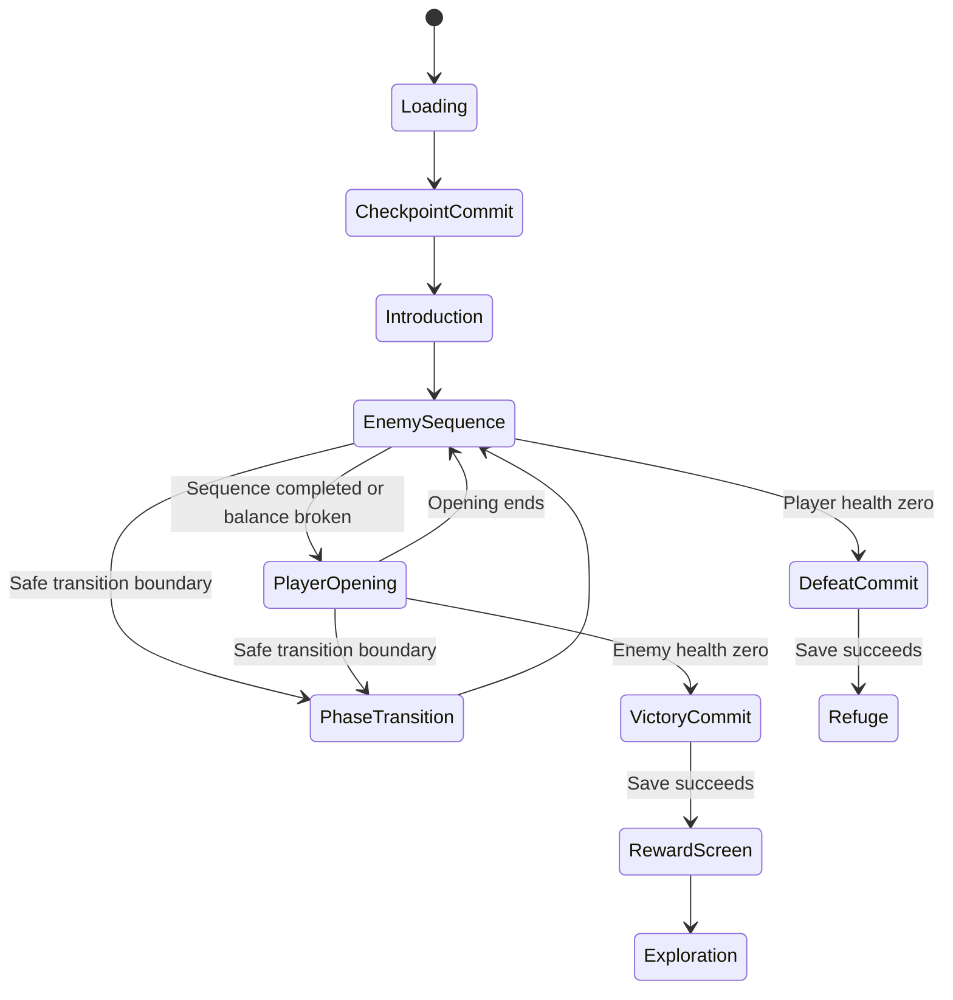
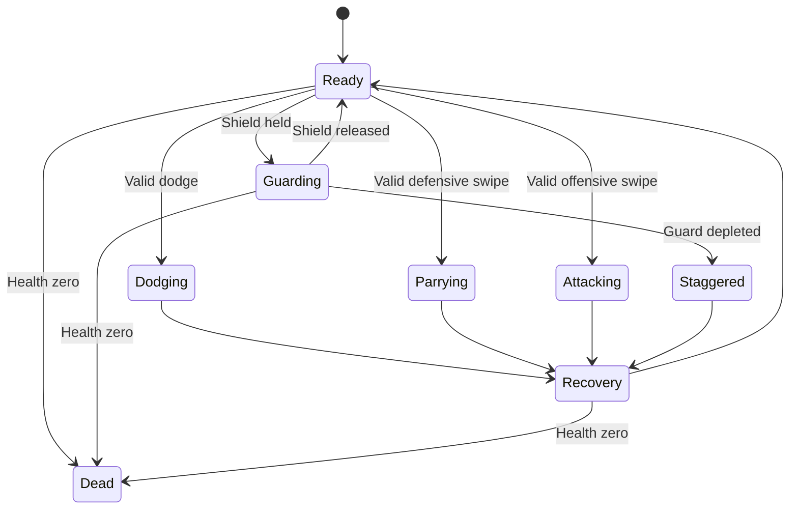

# 3. Combat specification

## 3.1 Encounter model

Combat uses fixed encounter anchors with authored local movement:

- One player and one active opponent.
- No free locomotion during duels.
- Dodges, lunges, recoil, and finishers use bounded motion.
- Decorative background actors never participate in combat.
- Weapon contact presentation follows logical combat resolution.
- Physics collisions do not decide damage.

The camera maintains a stable gameplay axis. It may move for introductions and finishers, but cannot reverse directional expectations during an attack.

## 3.2 Phone controls

The lower portion of the screen contains a reachable gesture surface and defensive controls. Required enemy tells remain visible above it.

| Input | Result |
|---|---|
| Directional swipe during enemy sequence | Parry attempt |
| Directional swipe during player opening | Attack |
| Hold shield control | Guard |
| Tap left dodge control | Dodge left |
| Tap right dodge control | Dodge right |
| Tap equipped ability control | Activate the selected ability |
| Tap exploration destination | Travel to that node |
| Drag exploration view | Limited camera inspection |

Provide mirrored left-handed and right-handed layouts, adjustable control scale, and a reach-calibration screen.

**There is no mandatory simultaneous two-finger action.**

### Gesture recognizer contract

Initial tuning defaults:

- Four cardinal directions.
- Recognition after travel exceeds **6% of the screen’s shorter dimension**.
- Maximum recognition duration: **350 ms**.
- Commit when the threshold is crossed, without waiting for finger release.
- Emit one action per gesture.
- Require finger release before another swipe.
- Use normalized screen coordinates.
- Capture the pointer’s owner and interaction phase at touch start.
- A gesture beginning on UI remains owned by that UI control.
- Cancel a gesture if its captured combat phase expires before commitment.
- Never reinterpret a stale parry as an attack.
- Allow one buffered offensive command, expiring after **120 ms**.
- Do not buffer defensive swipes before their valid window.

Direction classification uses the dominant axis. Exact diagonal ties use one documented, consistent rule. A short visual trace communicates the recognized direction.

These values are editable tuning data. Changes require the same ergonomic acceptance checks.

## 3.3 Combat resources

| Resource | Rule |
|---|---|
| Health | Reaching zero ends the encounter. |
| Guard | Blocking consumes finite encounter guard; depletion causes a short stagger. |
| Dodge charges | Three charges; each dodge consumes one. One charge returns after three seconds without dodging. |
| Enemy balance | Successful defense builds pressure toward a longer attack opening. |
| Focus | Successful defense charges the equipped active ability. |

Starting prototype values:

| Parameter | Initial value |
|---|---:|
| Guard capacity | 100 |
| Standard blocked-hit cost | 20 |
| Heavy blocked-hit cost | 40 |
| Guard-break stagger | 600 ms |
| Dodge duration | 360 ms |
| Dodge avoidance interval | 50–230 ms after commitment |
| Parry interval | Final 140 ms before impact |
| Normal attack opening | 2 seconds |
| Balance-break opening | 3 seconds |
| Offensive command buffer | 120 ms |

Standard parry success adds 25 balance, dodge success adds 10, and block success adds 5. Balance breaks at 100 and then resets. Balance begins decaying after three seconds without a successful defensive action.

These are starting balance values, not evidence of final game feel.

## 3.4 Attacks and defensive rules

Each enemy attack explicitly defines:

- Telegraph duration.
- Impact time.
- Recovery duration.
- Required screen-space parry direction.
- Allowed defense actions.
- Safe dodge side or sides.
- Guard cost.
- Health damage.
- Balance consequences.
- Interruptibility.
- Animation and presentation references.

There is no implicit “always swipe opposite the weapon” rule. The game teaches its own consistent directional convention.

Attack categories:

| Category | Valid responses |
|---|---|
| Standard strike | Authored combination of block, parry, and dodge |
| Heavy strike | High guard cost; parry and/or designated dodge |
| Guard-breaking strike | Dodge or parry when explicitly allowed |
| Unparryable strike | Clearly signaled dodge response |
| Feint | Distinct anticipation that resolves into a readable committed attack |

Use animation, shape, timing, and optional sound together. Color alone never communicates the required response.

Initial telegraphs start at approximately 650 ms. Faster follow-ups must remain readable and respect an authored minimum. Difficulty must not silently shorten defense windows.

## 3.5 Offense and skill expression

During an opening:

- Each accepted swipe starts one attack.
- Directional sequences unlock small combo bonuses.
- Recovery and the single-command buffer prevent uncontrolled attack queues.
- Attack timing comes from the combat timeline.
- Equipment changes damage and secondary bonuses without changing the fundamental gesture grammar.

Three launch active abilities:

1. Restore 25% maximum health.
2. Restore 35 guard.
3. Increase damage during the next opening by 25%.

Each consumes full Focus. Only one ability is equipped.

Skill depth comes from:

- Choosing between safe guarding and efficient parrying.
- Preserving dodge charges.
- Recognizing safe dodge directions.
- Building balance breaks.
- Using complete attack openings.
- Choosing when to spend Focus.
- Learning boss-specific sequences.

## 3.6 State diagrams

### Encounter state

Every active state can suspend. Suspension freezes combat and clears incomplete gestures.

### Player action state

Priority is explicit:

1. Encounter cancellation or suspension.
2. Death.
3. Valid defense at the impact timestamp.
4. Damage and stagger.
5. Boss phase transition at a safe boundary.
6. Recovery completion.
7. Buffered offense.

Mutual death resolves as defeat.

## 3.7 Combat timing authority

Use **one event-time combat timeline**, represented internally in integer microseconds.

Per frame:

1. Read input records and preserve their timestamps.
2. Map device timestamps into the active combat clock.
3. Queue commands.
4. Advance the timeline chronologically.
5. Resolve commands and authored milestones.
6. Emit presentation events.
7. Update animation and UI from the resolved state.

At the same timestamp, valid defensive input resolves before its corresponding impact. Tied inputs preserve arrival order.

Animator events, physics callbacks, camera callbacks, and UI callbacks cannot independently apply damage.

The system does not claim cross-platform deterministic networking. Recorded-input comparisons are used to detect frame-rate-dependent behavior.

### Suspension and stalls

- Focus loss suspends immediately.
- Unfinished gestures are discarded.
- A frame stall exceeding **150 ms** suspends before catch-up can resolve unseen attacks.
- Resume uses a countdown.
- The next unresolved incoming strike receives at least 650 ms of visible warning.
- Resolved damage and resource expenditure are retained.
- A terminated process restarts the current encounter from its committed pre-fight checkpoint.

Hit stop and slow motion enter after the basic timing model passes device acceptance. Both must operate through this same clock.

---

[Return to development plan](../development-plan.md)
